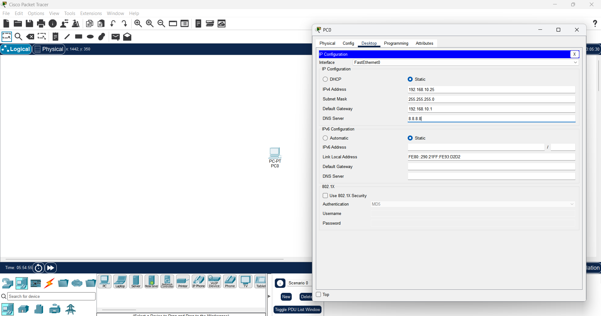
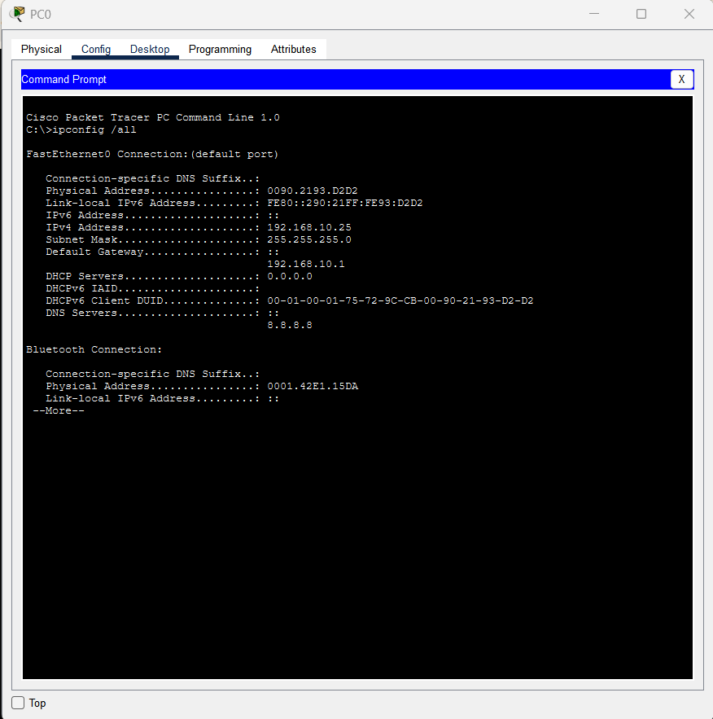
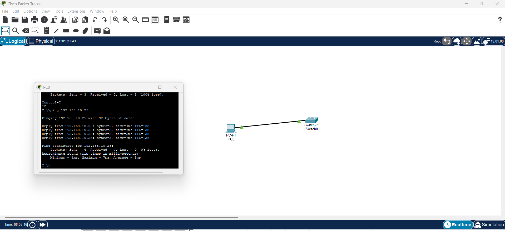

# single-host-static-ipv4
Cisco Packet Tracer lab for static IPv4 configuration and local loopback verification.
# Single-Host Static IPv4 Addressing & Local Loopback Verification

## Objective

Configure a standalone workstation (PC0) with a static IPv4 address in Cisco Packet Tracer and verify the network configuration and local TCP/IP functionality using Command Prompt utilities.

## Tools Used

* Cisco Packet Tracer
* Command Prompt
* IPv4

## Network Configuration

| Parameter       | Assigned Value      |
| --------------- | ------------------- |
| Device Name     | PC0                 |
| IPv4 Address    | 192.168.10.25       |
| Subnet Mask     | 255.255.255.0 (/24) |
| Default Gateway | 192.168.10.1        |
| DNS Server      | 8.8.8.8             |

## Purpose of the Lab

This lab demonstrates how to configure a static IPv4 address on a workstation and verify the configuration.

Two types of local verification are performed:

* `ping 127.0.0.1` verifies the local TCP/IP loopback stack.
* `ping 192.168.10.25` verifies the workstation's assigned IPv4 address.

The `ipconfig /all` command is used to display and verify the configured network parameters.

## Procedure

### 1. Configure Static IPv4 Address

PC0 was opened in Cisco Packet Tracer and the following values were entered under:

**Desktop → IP Configuration → Static**

```text
IPv4 Address     : 192.168.10.25
Subnet Mask      : 255.255.255.0
Default Gateway  : 192.168.10.1
DNS Server       : 8.8.8.8
```

### 2. Verify IPv4 Configuration

The following command was executed in the PC0 Command Prompt:

```text
ipconfig /all
```

The output confirmed that PC0 was assigned:

```text
IPv4 Address     : 192.168.10.25
Subnet Mask      : 255.255.255.0
Default Gateway  : 192.168.10.1
DNS Server       : 8.8.8.8
```

### 3. Verify the Local TCP/IP Stack

The loopback address was tested using:

```text
ping 127.0.0.1
```

The loopback address represents the local computer itself and is used to check whether the local TCP/IP stack is functioning.

### 4. Verify the Assigned Local IP Address

The configured IPv4 address was tested using:

```text
ping 192.168.10.25
```

This test checks the response of the IPv4 address assigned to PC0.

## Screenshots

### 1. Static IP Address Configuration



### 2. IPv4 Configuration Verification



### 3. Successful Loopback Verification


### 4. Local IP Address Verification



## Result

PC0 was successfully configured with the specified static IPv4 parameters. The `ipconfig /all` command was used to verify the assigned IPv4 configuration, and the loopback test was used to verify the local TCP/IP stack.

The local IP address test was also performed to verify the assigned IPv4 address.

## Key Commands

```text
ipconfig /all
ping 127.0.0.1
ping 192.168.10.25
```

## Conclusion

This experiment demonstrates the basic configuration and verification of static IPv4 addressing on a workstation using Cisco Packet Tracer. It also demonstrates how `ipconfig` and `ping` can be used to troubleshoot and verify local network configuration.
